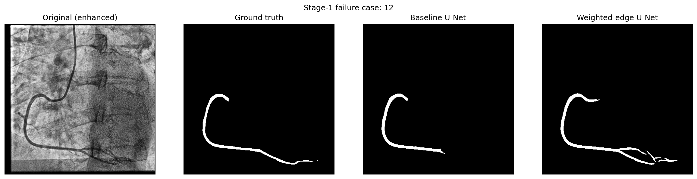
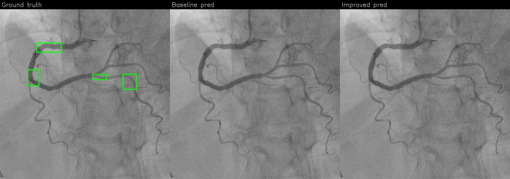

# ARCADE: Coronary Vessel Segmentation & Stenosis Detection

**Candidate:** _your name_ — **Date:** _fill in_ — Dataset: ARCADE (Popov et al., 2024, Zenodo 10390295)

> Placeholders are written `‹like this›`. After running `scripts/run_all.sh`, copy the
> numbers from `report/figures/*_metrics.json` / `*_table.md` into the tables below.
> Target length ≤ 5 pages.

## 1. Setup & reproducibility
PyTorch + `segmentation-models-pytorch` (U-Net) and Ultralytics (YOLOv8); all versions pinned in
`requirements.txt`, seeds and hardware logged to `run_manifest.json`. Data prep: `syntax` polygons are
unioned per image into one binary vessel mask at 512×512 (U-Net target); `stenosis` boxes become
normalized YOLO labels for a single class. Inputs use the paper's enhancement: white top-hat (50×50) →
rescale → CLAHE (8×8, clip 2).

**Key dataset caveat (motivates Stage 1.2):** ARCADE masks label only ~60–80% of the vasculature —
cardiologists annotate only clinically important vessels. Under a naive loss, real-but-unlabeled vessels
act as false background, which is exactly why fine/low-contrast branches break and why a boundary-weighted
loss helps. "Reproduce" here means a faithful recipe and comparable metrics, not bit-identical numbers.

## 2. Stage 1 — Vessel segmentation (U-Net)

**2.1 Baseline.** smp `Unet(resnet34, in=1, classes=2)` (residual encoder ≈ the paper's Residual U-Net),
Dice+CE, Adam 1e-3, cosine decay, 512×512, early-stopped on val Dice.

**2.2 Targeted improvement — weighted-edge loss (prescribed).** Edge map from GT per the paper:
`gx,gy=∇(mask); edge=gx²+gy²`, gradient re-applied, normalized and dilated 1–3 px → per-pixel weight
`w = 1 + λ·edge_norm` applied to both CE and Dice before reduction. λ swept over {2,4,6,8,10}, best on val.
Everything else identical to the baseline for a controlled comparison.

**2.3 Comparison (val).**

| Metric | Baseline U-Net | Weighted-edge U-Net | Δ |
|---|---|---|---|
| Dice | ‹b› | ‹i› | ‹Δ› |
| IoU | ‹b› | ‹i› | ‹Δ› |
| clDice | ‹b› | ‹i› | ‹Δ› |
| Precision | ‹b› | ‹i› | ‹Δ› |
| Recall | ‹b› | ‹i› | ‹Δ› |
| Thin-vessel recall | ‹b› | ‹i› | ‹Δ› |

Failure case auto-selected on the baseline (lowest thin-vessel recall): `‹id›`.

*Original · GT · baseline · weighted-edge. The weighted-edge model recovers ‹fine branch / continuity› the baseline drops.*

## 3. Stage 2 — Stenosis detection (YOLOv8)

**3.1 Baseline.** `yolov8m` on `stenosis`, imgsz 640, Ultralytics defaults, mosaic off the last 10 epochs.

**3.2 Targeted improvement — ONE justified change.** Tied to the baseline failure type (`‹missed lesion›`
→ domain-specific augmentation: softened mosaic + copy-paste of rare stenoses + mild affine/photometric
jitter so small lesions survive training; OR `‹catheter false positive›` → advanced preprocessing:
top-hat+CLAHE (+optional Frangi vesselness) to suppress line-like artifacts). Only this knob-group changed.

**3.3 Comparison (val).**

| Metric | Baseline YOLOv8 | Improved YOLOv8 | Δ |
|---|---|---|---|
| Precision | ‹b› | ‹i› | ‹Δ› |
| Recall | ‹b› | ‹i› | ‹Δ› |
| F1 | ‹b› | ‹i› | ‹Δ› |
| mAP@50 | ‹b› | ‹i› | ‹Δ› |
| mAP@50:95 | ‹b› | ‹i› | ‹Δ› |

*GT · baseline · improved on the selected failure (`‹id›`, type `‹type›`).*

## 4. Metric justification
**Segmentation:** Dice & IoU for region overlap; **clDice** because coronary vessels are thin connected
trees where topology/connectivity matters more than raw area; **thin-vessel recall** to expose the exact
fine-vessel weakness the weighted-edge loss targets. **Detection:** Precision, Recall, F1, mAP@50,
mAP@50:95 — we emphasise **recall/F1** because a missed stenosis (false negative) is clinically costlier
than a false alarm.

## 5. Stage 3 — Comparative analysis & synthesis
**5.1 Which stage improved more (relative)?** Per-stage relative gain `(improved−baseline)/baseline`:
Stage 1 ‹x%› vs Stage 2 ‹y%› → ‹Stage 1› moved more. Reasoning: the weighted-edge loss attacks a
*structural label flaw* (systematically unlabeled vessels mislabeled as background), so it corrects a
biased training signal directly; the YOLO augmentation only nudges an already-reasonable detector and is
bounded by the small number of annotated stenosis instances.

**5.2 Ensemble.** Run the improved U-Net to get a per-image vessel probability mask and feed it to YOLOv8
as an extra input — implemented as a 3-channel composite `[enhanced gray | vessel mask | original gray]`
(stock Ultralytics, no architecture change, **reusing the `yolov8_improved` slot — no 5th weight**), then
fine-tune. Ensemble delta vs improved-only: ‹report from figures/ensemble›. Why it can beat either alone:
the vessel prior constrains stenoses to lie on the coronary tree, cutting catheter/background false
positives and focusing capacity on plausible lesion sites — anatomical context the detector lacks on its own.

## 6. AI Tool Usage
This solution was produced with **Claude (Anthropic)** acting as an ML pair-programmer: scaffolding the
repo, drafting the data converters, losses (incl. the weighted-edge loss), metrics, training/eval scripts,
ensemble, and this report. Every generated source file carries an `# AI-assisted` banner. All code,
configuration choices, and results were reviewed, run, and validated by the candidate; design decisions
(framework choice, λ sweep, the single Stage-2 change, ensemble design) were made by the candidate with AI
assistance. No other AI tools were used.
