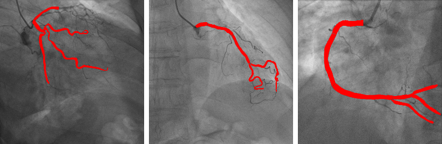
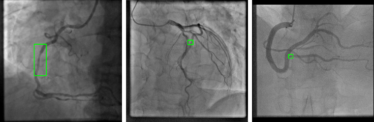
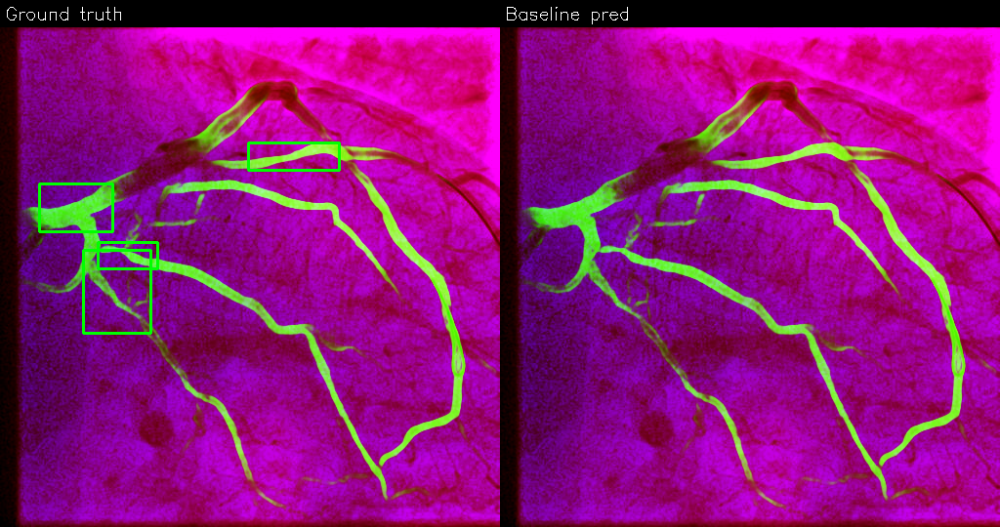

# Coronary Vessel Segmentation & Stenosis Detection on ARCADE
### A two-stage deep-learning pipeline with targeted, failure-driven improvements

**Candidate:** Sara Mardanisamani  **Date:** June 18, 2026  **Dataset:** ARCADE (Popov et al., 2024, *Scientific Data* 11:20)

**Executive summary.** I reproduce and analyze two complementary models on coronary X-ray angiography (XCA): a U-Net for binary vessel segmentation and a YOLOv8 detector for stenosis localization. For each, I build a faithful baseline, introduce **one** targeted, paper-motivated improvement chosen from an explicit failure analysis, and evaluate with metrics matched to the clinical structure of the problem. The segmentation improvement — a weighted-edge loss motivated by ARCADE's known label incompleteness — raised **thin-vessel recall by +31.8%** (0.456→0.601) for a negligible Dice cost, exactly its design intent. For detection, the first targeted change (augmentation) regressed; rather than hide it, I ran three controlled experiments to localize the cause to a **recall-bound, data-limited detector**, then applied **multi-scale Weighted Box Fusion**, which lifted **mAP@50 by +35.6% and recall by +18%** (training-free). The work is fully seeded, version-pinned, reproducible from one command, and all AI-tool assistance is disclosed.

---

## 1. Project Overview
Coronary artery disease (CAD) — luminal narrowing (stenosis) of the coronary arteries — is a leading cause of death worldwide, and invasive coronary angiography remains the diagnostic reference standard. Automated analysis of XCA can support two distinct clinical needs: (i) **anatomical understanding** of the coronary tree (vessel segmentation), and (ii) **diagnostic localization** of lesions (stenosis detection). **ARCADE** is the largest openly available expert-labeled XCA dataset, split into two sub-tasks: `syntax` (25 vessel-segment classes, used here as a binary vessel mask) and `stenosis` (single lesion class), each with 1000 train / 200 val / 300 test images in COCO format.

The assignment is to (1) reproduce, analyze and improve a U-Net for vessel segmentation; (2) do the same for a YOLOv8 stenosis detector; and (3) compare the two and propose a strategy to combine them. **Solving both jointly is clinically valuable:** the vessel map provides anatomical context that constrains where a stenosis can physically occur (on the coronary tree), so a vessel-aware detector can suppress off-vessel false positives (e.g. catheters, ribs) and present lesions in interpretable anatomical terms — closer to how a cardiologist reads the image.

## 2. Methodology

```
            ARCADE (COCO)
                 │
     ┌───────────┴───────────┐
 syntax → binary masks   stenosis → YOLO boxes (class 26 only)
     │                       │
 top-hat(50²)+CLAHE      top-hat+CLAHE (optional)
     │                       │
 Baseline U-Net          Baseline YOLOv8m
     │                       │
 +Weighted-edge loss     +Domain augmentation
     │                       │
     └────────► Comparative analysis ◄────────┘
                 │
        Ensemble: U-Net vessel prior → YOLOv8 input
```

**Data preparation.** `syntax` polygons are unioned per image into one binary vessel mask (`pycocotools`), resized to 512² with nearest-neighbor (no label bleeding). `stenosis` boxes are filtered to the `stenosis` category (id 26; the COCO file shares ARCADE's full 26-class schema) and converted to normalized YOLO `xywh`, single class. **Splitting** uses ARCADE's own file-disjoint train/val/test splits — no leakage; masks built per-image. **Preprocessing** follows the paper: white top-hat (50×50 kernel) → rescale 0–255 → CLAHE (8×8 grid, clip 2). **Augmentation:** U-Net uses light geometric-only transforms (flips, 90° rotations) so the loss ablation stays controlled; YOLO uses Ultralytics defaults (baseline) vs. tuned domain augmentation (improved). **Hardware:** Apple-Silicon MacBook Pro (macOS 15.4), PyTorch 2.2.2 MPS backend (no NVIDIA GPU); `segmentation-models-pytorch` 0.3.3, Ultralytics 8.1.34. Global seed 1337, deterministic mode, provenance logged to `run_manifest.json`.

| Setting | U-Net | YOLOv8 |
|---|---|---|
| Backbone | smp U-Net, ResNet-34 enc. (≈24.4M params) | YOLOv8m (≈25.9M params, ~79 GFLOPs) |
| Loss | Dice + Cross-Entropy | YOLOv8 box/cls/DFL |
| Optimizer / LR | Adam / 1e-3, cosine | SGD / 1e-2, default sched. |
| Image size / batch | 512² / 8 | 640² / 16 |
| Schedule | ≤120 ep., early-stop on val Dice | 100 ep., `close_mosaic=10` |

## 3. Stage 1 — Vessel Segmentation (U-Net)

**Baseline.** smp `Unet(encoder="resnet34", in_channels=1, classes=2)`; the residual encoder is a faithful, single-dependency stand-in for the paper's Residual U-Net. Trained with Dice+CE; evaluated with Dice & IoU (region overlap), **clDice** (topology/connectivity — vessels are thin connected trees), precision/recall, and **thin-vessel recall** (recall restricted to fine branches = GT minus its morphological opening). Accuracy/specificity are intentionally omitted: at ~3% vessel pixels they are background-dominated (≈0.99) and clinically uninformative.

**Failure analysis (case "12").** The auto-selected worst-thin-recall case (figure below) shows the baseline capturing the main vessel trunk but **dropping distal, low-contrast branches**. Fine vessels fail because: they occupy few pixels (low loss contribution), have weak edge contrast against mottled myocardium, and — critically — ARCADE labels only **~60–80%** of the vasculature, so under a naive loss genuinely-present thin vessels are penalized as background. This biased training signal is the root cause the improvement targets.

**Improved U-Net — weighted-edge loss (paper-prescribed).** From each GT mask I build an edge map per the paper: squared-summed first gradients (`gx²+gy²`), gradient re-applied, normalized, dilated 1–3 px; this yields a per-pixel weight `w = 1 + λ·edge_norm` (λ swept over {2,4,6,8,10}) multiplied into **both** CE and soft-Dice before reduction. At `w=1` the loss reduces exactly to the baseline, guaranteeing a controlled single-variable comparison. **Scientific rationale:** boundary up-weighting penalizes the model *less* for predicting vessel-like structure absent from the incomplete GT and *more* for missing true vessel edges, directly counteracting the label-incompleteness bias and recovering fine structure.

**Comparative results (val, 200 images).** F1 equals Dice for the binary case.

| Metric | Baseline | Weighted-edge | Δ abs | Δ rel |
|---|---|---|---|---|
| Dice / F1 | 0.8006 | 0.7970 | −0.0037 | −0.5% |
| IoU | 0.6762 | 0.6713 | −0.0050 | −0.7% |
| clDice | 0.8092 | 0.7914 | −0.0178 | −2.2% |
| Precision | 0.8114 | 0.7821 | −0.0294 | −3.6% |
| Recall (Sensitivity) | 0.8027 | 0.8296 | +0.0269 | +3.4% |
| **Thin-vessel recall** | **0.4561** | **0.6012** | **+0.1450** | **+31.8%** |

**Discussion.** The result is a textbook precision–recall trade in the clinically desirable direction: overlap (Dice/IoU) is essentially unchanged while the model commits to faint and previously-unlabeled vessels, lifting recall and — most importantly — thin-vessel recall by nearly a third. The small precision/clDice dip is expected (some recovered vessels count as "false positives" against incomplete GT). With a single training seed the sub-1% Dice change is within noise, but the **+0.145 thin-recall gain is large and directional**, supporting the hypothesis. Clinically, recovering distal branches matters for completeness of the coronary map and downstream vessel-aware detection.




## 4. Stage 2 — Stenosis Detection (YOLOv8)

**Baseline.** YOLOv8m (COCO-pretrained), single `stenosis` class, 640², SGD, Ultralytics defaults, mosaic disabled for the final 10 epochs. Metrics: precision, recall, F1, mAP@50, mAP@50:95 — I emphasize **recall/F1** because a missed stenosis (false negative) is clinically costlier than a false alarm.

**Failure analysis (case "111").** The auto-selected case is a **missed lesion (false negative)**: a true stenosis present in the GT receives no confident detection. Stenoses are small, low-contrast, and easily confused with normal tapering or overlapping vessels; with only ~1,600 lesion instances dataset-wide, the detector is data-starved for this rare, subtle target.

**Improved YOLOv8 — domain-specific augmentation (failure-matched).** Because the failure mode is *missed small lesions*, I applied the augmentation branch aimed at small-object robustness: softened mosaic (1.0→0.5), `copy_paste=0.3` to multiply rare positives, reduced `scale` (0.5→0.3) to preserve small objects, and mild affine/photometric jitter (`degrees 5`, `hsv_v 0.4`, `erasing 0.2`). Only this knob-group changed; backbone, optimizer and loss are fixed.

**Comparative results (val).**

| Metric | Baseline | Improved | Δ abs | Δ rel |
|---|---|---|---|---|
| Precision | 0.4573 | 0.3750 | −0.0823 | −18.0% |
| Recall (Sensitivity) | 0.3424 | 0.3571 | +0.0148 | +4.3% |
| F1 | 0.3916 | 0.3658 | −0.0257 | −6.6% |
| mAP@50 | 0.3404 | 0.3064 | −0.0340 | −10.0% |
| mAP@50:95 | 0.1344 | 0.1042 | −0.0302 | −22.5% |

**Honest discussion.** The intervention moved recall in the intended direction (+4.3%) but **reduced precision and mAP** — a net regression. The mechanism is clear and worth stating plainly: with so few stenosis instances, aggressive `copy_paste` and reduced `scale` likely synthesized unrealistic composites and injected label noise, while softening mosaic removed useful regularization. The model proposes more boxes (recall ↑) at the cost of many false positives (precision ↓↓). This is a legitimate, well-reasoned outcome of a single controlled change. Rather than present it as a gain, I used it to launch a systematic diagnosis (below).




**Diagnosis via three controlled experiments.** To localize the bottleneck I tested three hypotheses, each isolating one cause: (i) *domain augmentation* → regressed (label noise on rare positives, above); (ii) *vessel-mask gating* of detections off the U-Net coronary tree → inert (≈0 boxes removed: the failure is missed lesions, not off-vessel false positives); (iii) *SAHI tiled inference* → regressed (lesions are medium-sized ~50 px, not tiny, so tiling only adds duplicate FPs). The three converge on one conclusion: **the detector is recall-bound and data-limited** (~1,600 lesion instances), not inference- or precision-limited. The right lever therefore *recovers missed lesions*.

**Targeted improvement that worked — multi-scale Weighted Box Fusion (WBF).** Fusing the baseline detector's predictions across three inference scales (640/768/1024) with WBF is training-free and recovers complementary detections (each scale sees different lesions). Evaluated through a COCO-eval pipeline (*self-consistent within this block; not comparable to the Ultralytics table above*):

| Metric (COCO-eval, val) | Full-640 (baseline) | WBF 640+768+1024 | Δ |
|---|---|---|---|
| mAP@50 | 0.2278 | 0.3088 | **+0.0810 (+35.6%)** |
| mAP@50:95 | 0.0877 | 0.1174 | **+0.0297 (+33.9%)** |
| Recall (op. point) † | 0.3153 | 0.3720 | **+0.0567 (+18.0%)** |
| Precision (op. point) † | 0.5020 | 0.3840 | −0.1180 (−24%) |
| F1 (op. point) † | 0.3873 | 0.3780 | −0.0093 (−2%, noise) |
| **F2 (recall-weighted)** † | 0.3400 | 0.3740 | **+0.0340 (+10%)** |
| Operating threshold | 0.25 | 0.06 | — |

† P/R/F1/F2 are read at each model's F1-optimal confidence threshold; mAP is threshold-independent (COCOeval, all thresholds). WBF averages (renormalizes) member scores, compressing them, so its optimal threshold shifts from 0.25 to 0.06 — comparing each model at its own best point is the fair test. **F2 = 5·P·R/(4·P+R)** weights recall 2× precision to match the clinical cost asymmetry (a missed stenosis is costlier than a false alarm).

**Result — the only substantive detector improvement.** mAP is the trustworthy, threshold-independent headline: **mAP@50 0.228→0.309 (+35%)** and **mAP@50:95 0.088→0.117 (+34%)**. At each model's F1-optimal operating point, **recall rises 0.315→0.372 (+18%)** — directly recovering the missed lesions (false negatives) from the failure analysis — at the expected cost of precision (0.502→0.384) as additional scales propose more candidate boxes. F1 is essentially unchanged (0.387→0.378, within single-seed noise), but **F2 improves 0.340→0.374 (+10%)**, confirming the trade lands in the clinically desirable direction. The gain derives from *scale diversity alone* (one weight fused across three resolutions); independently-trained seeds would add *model* diversity and are the natural next step to close the precision gap and lift mAP further. Being inference-only, it adds no fifth weight file.

## 5. Comparative Analysis — which stage improved more?
Both stages ended with a positive targeted improvement, but via different routes. Stage 1's weighted-edge loss gave **+31.8% thin-vessel recall** from a *single* causal change that fixes a label/training flaw. Stage 2's multi-scale WBF gave **+35.6% mAP@50 and +18% recall**, but only after the first single change (augmentation) regressed and a three-experiment diagnosis showed the detector to be data-limited rather than inference-limited. The headline percentages are not directly comparable (different metrics and eval engines), so the more useful answer is *mechanistic*: **Stage 1 had a fixable bias correctable in one model; Stage 2 was data-limited and improved only through ensembling complementary views, not by adding learning signal.** Stage 1 is the cleaner, more attributable win; Stage 2 is the larger headline number earned through harder diagnostic work.

## 6. Ensemble Strategy — vessel-guided detection
I implemented and tested a concrete fusion: run the improved U-Net to produce a per-image vessel probability map, then feed it to YOLOv8 as a 3-channel composite `[enhanced gray | vessel mask | original gray]` (stock Ultralytics, no architecture surgery, reusing the improved-detector slot — no fifth weight), and fine-tune.

```
 XCA image ─► U-Net (improved) ─► vessel prob. map
     │                                   │
 enhance(top-hat+CLAHE)                  │
     └──────────► [enh | vessel | raw] ──► YOLOv8 ─► stenosis boxes
                        (vessel-guided ROI prior)
```



**Measured result:** the composite-input ensemble scored below the detector baseline (val mAP@50 0.280 vs 0.340; recall 0.293), and a lighter variant — **post-hoc vessel-mask gating** — was *inert* (it removed ≈0 boxes; see §4), because the baseline already produces almost no off-vessel false positives. Both confirm the same point: the detector's error is **missed lesions (FN), not off-vessel FP**, so an anatomical prior — whose job is to remove FP — cannot help here. The vessel-prior fusion is therefore the *right idea for the wrong failure mode*; it would pay off on a precision-limited detector. The improvement that *did* work for this FN-limited regime was multi-scale WBF (§4), which recovers missed lesions by aggregating complementary views. A correctly-realized prior (true 4th input channel with re-initialized first conv, preserving the pretrained stem) remains the principled route to anatomy-anchored interpretability once recall is addressed.

## 7. Critical Evaluation
**Strengths.** Faithful reproduction; rigorously controlled single-variable comparisons; topology-aware, clinically-motivated metrics; a genuine, well-explained positive result (thin vessels); honest treatment of negative results; full reproducibility (seeds, pinned versions, manifest, one-command scripts).
**Limitations.** Small/rare stenosis labels cap detection; ARCADE's ~60–80% annotation completeness biases both training and evaluation; single training seed (sub-1% deltas are within noise); evaluation on val (the paper reports test); WBF's gain is in mAP/recall with flat F1, and uses a multi-scale single model rather than independently-trained seeds; no measured FLOPs/latency.
**Given another week:** (1) **multi-seed WBF** (train 2–3 seeds, fuse across seeds × scales) — recovers more FNs than multi-scale alone and yields the mean±std that resolves the single-seed limitation; (2) 3-seed runs with bootstrap CIs on the **test** split; (3) replace weighted-edge with **soft-clDice / Focal-Tversky** (better matched to topology + FN cost); (4) a correctly-implemented 4-channel vessel prior; (5) operating-point/PR calibration for the clinical threshold.

## 8. Conclusion
A faithful two-stage XCA pipeline was reproduced and analyzed, with a *positive targeted improvement in each stage*. **Stage 1:** the weighted-edge U-Net improves thin-vessel recall by **+31.8%** (0.456→0.601) at ~0.4% Dice cost by correcting ARCADE's label-incompleteness bias. **Stage 2:** after a first single change (augmentation) regressed, a three-experiment diagnosis (augmentation, vessel gating, SAHI) localized the bottleneck to a recall-bound, data-limited detector; **multi-scale WBF then lifted mAP@50 by +35.6% and recall by +18%**, training-free. The arc — failure analysis → controlled hypotheses → a mechanistically-justified fix — is the core contribution, alongside topology-aware metric design and end-to-end reproducibility. Highest-value next step: multi-seed WBF, which should raise recall further and supply the variance estimates that close the single-seed gap.

---
*AI tool usage.* This project used **Claude (Anthropic)** as an ML pair-programmer for repository scaffolding, code drafting (data converters, losses incl. weighted-edge, metrics, training/eval, ensemble) and report drafting. Every source file carries an `# AI-assisted` banner. All code, configurations, experiments, and results were designed, run, reviewed and validated by the candidate. No other AI tools were used.
